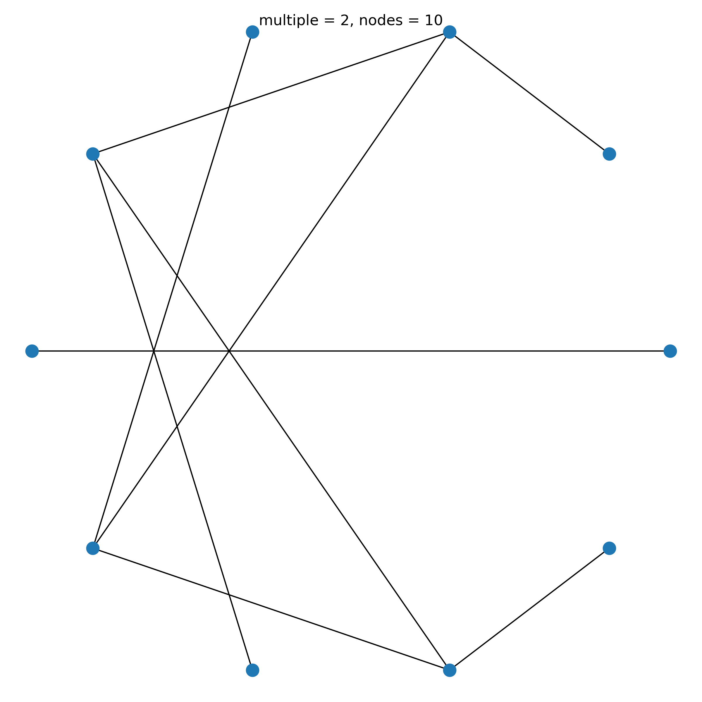
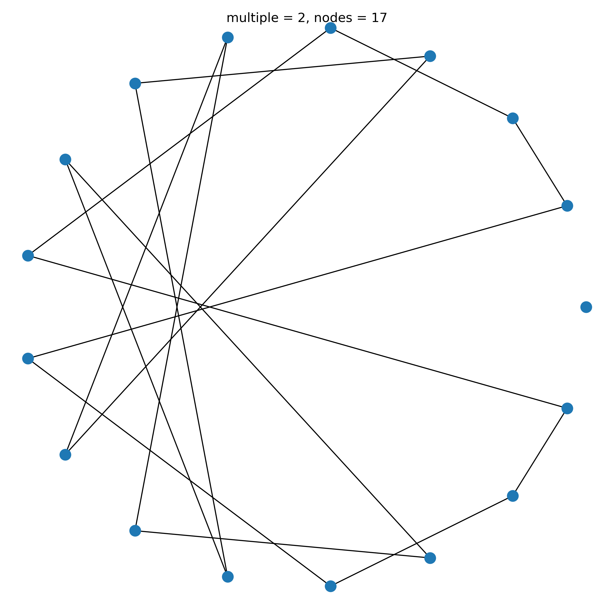

# TimesTablesGraphs

This is a personal project that draws intricate images using modular arithmetic.
Given two integers, <em>m</em> and <em>n</em> we will create a circular ring of nodes 0 through <em>n</em>. 
An edge will be drawn between two nodes: <em>i</em> and <em>m</em> &times; <em>i</em> modulus <em>n</em> (where 0 &le; 
<i>i</i> &le; <em>n</em>). 

## Example Images Generated
- m = 2, n = 10  
  
- m = 2, n = 17
  
- m = 2, n = 150
  
- m = 4, n = 92
  
- m = 102, n = 82
  

